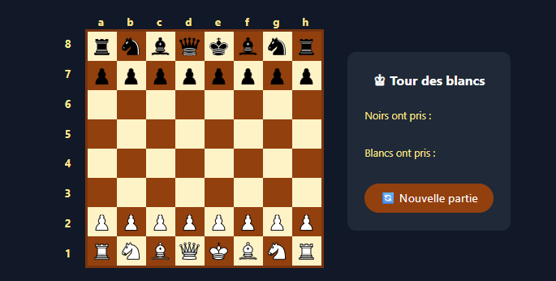

# ♟️ Chess Game — React + TypeScript + Zustand

A fully functional chess game built with React, TypeScript, Tailwind CSS and Zustand, implementing all standard chess rules from scratch.



---

🎮 **[Jouer en ligne](https://chess-game-dxog.vercel.app/)**

## 🚀 Technologies

- **React 19** — UI and component architecture
- **TypeScript** — Strong typing for pieces, positions and game state
- **Tailwind CSS** — Styling and responsive design
- **Zustand** — Global state management
- **Vite** — Build tool and dev server

---

## ✅ Features

- ♟️ Full chess piece movement logic (all 6 piece types)
- 🔄 Turn-based gameplay (White / Black)
- ⚠️ Check detection
- 🏁 Checkmate detection
- 🏰 Castling (both kingside and queenside)
- ♟️ Pawn promotion (automatic to Queen)
- 🎯 En passant capture
- 📋 Captured pieces display
- 🗺️ Board coordinates (a-h, 1-8)
- 🔁 New game button
- 🖼️ SVG chess pieces (Lichess cburnett set)

---

## 🧠 Technical Challenges

### 1. Piece Movement Logic
Each piece has its own movement algorithm implemented from scratch:
- **Sliding pieces** (Rook, Bishop, Queen) use a `while` loop to explore each direction until hitting a piece or the board edge
- **Jumping pieces** (Knight, King) check all target squares directly without path verification
- **Pawns** have unique directional movement (forward only) and diagonal captures

### 2. Check Detection
After every move, `isKingInCheck` scans all opponent pieces and simulates their moves to detect if the king is under attack. This requires calling `getMovesForPiece` for every opponent piece on the board.

### 3. Illegal Move Filtering
Before displaying possible moves, each candidate move is simulated on a temporary board (`testBoard`). If the simulation leaves the king in check, the move is filtered out. This ensures players can never make a move that exposes their own king.

### 4. Castling (Roque)
Castling requires tracking whether the king and rooks have moved (`castlingRights` in Zustand store). Three conditions must be verified:
- No pieces between king and rook
- King not currently in check
- King does not pass through an attacked square (simulated by temporarily placing the king on the transit square)

### 5. En Passant
En passant requires memorizing the last move. When a pawn advances two squares, an `enPassantTarget` position is stored. On the next turn, an adjacent pawn can capture diagonally onto this empty square — the captured pawn is then removed from its original square (not the destination square).

### 6. Pawn Promotion
When a pawn reaches the opponent's back rank (row 0 or row 7), it is automatically promoted to a Queen. The promotion is detected in `movePiece` after the move is executed on `newBoard`.

### 7. State Management with Zustand
The full game state is centralized in a Zustand store:
- `board` — 8x8 matrix of pieces
- `currentPlayer` — whose turn it is
- `selectedPosition` — currently selected piece
- `possibleMoves` — valid moves for selected piece
- `isInCheck` / `isCheckmate` — game status flags
- `castlingRights` — tracks castling availability per color
- `capturedPieces` — pieces taken by each player
- `enPassantTarget` — en passant eligible square

---

## 🏗️ Project Structure

```
src/
├── components/
│   ├── Board.tsx        # Renders the 8x8 board with coordinates
│   └── Square.tsx       # Individual square with piece display
├── pages/
│   └── (none yet)
├── store/
│   └── gameStore.ts     # Zustand store — full game state & actions
├── types/
│   └── chess.ts         # TypeScript interfaces (Piece, Board, Position)
└── utils/
    ├── initialBoard.ts  # Creates the starting board position
    └── move.ts          # All piece movement functions + check detection
```

---

## 🛠️ Getting Started

```bash
# Clone the repository
git clone https://github.com/debeaune/chess-game.git
cd chess-game

# Install dependencies
npm install

# Start dev server
npm run dev
```

---

## 🔮 Future Improvements

- [ ] Pawn promotion with piece selection UI
- [ ] Stalemate detection
- [ ] Move history display
- [ ] AI opponent
- [ ] Online multiplayer

---

*Built by Marie Laure Debeaune*
